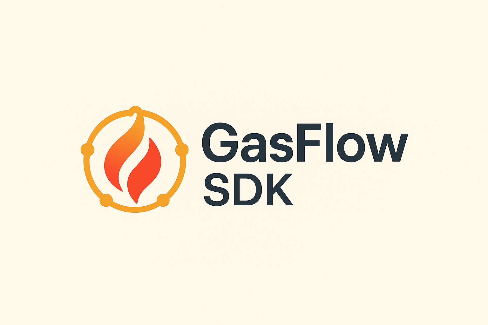

# GasFlow SDK - Multichain USDC Payment System

> **Circle Developer Bounty Submission** - Building a Multichain USDC Payment System using CCTP V2



## 🏆 Challenge Overview

This project addresses the **Circle Developer Bounty Challenge**: Building a Multichain USDC Payment System using Circle's Cross-Chain Transfer Protocol (CCTP) V2. Our solution enables seamless cross-chain USDC transfers with intelligent route optimization and gas payment flexibility.

## 🚀 What We Built

**GasFlow SDK** is a comprehensive TypeScript SDK that simplifies multichain USDC payments for developers. It provides:

- **Native Cross-Chain USDC Transfers** via Circle's CCTP V2 burn-and-mint protocol
- **Multi-Chain Balance Aggregation** across supported networks
- **Intelligent Route Optimization** for cost and speed efficiency
- **Dual Transfer Modes**: Fast (30s) and Standard (13-19min) transfers
- **Developer-Friendly API** with minimal integration complexity
- **Real-Time Transaction Tracking** with detailed status updates

### 🎯 Key Features

#### ✅ **CCTP V2 Integration (Production Ready)**
- Real Circle CCTP V2 contract integration
- Support for 5 testnet chains: Ethereum Sepolia, Arbitrum Sepolia, Base Sepolia, Avalanche Fuji, Polygon Amoy
- Automatic attestation polling and transfer completion
- Fast and Standard transfer mode optimization

#### 🚧 **Paymaster Integration (Under Construction)**
- USDC gas payments using Circle Smart Accounts
- ERC-4337 integration for gasless experiences
- Currently in beta - production refinement ongoing

## 🏗️ Architecture

```
┌─────────────────┐    ┌─────────────────┐    ┌─────────────────┐
│   Frontend UI   │    │   Demo Hub      │    │   SDK Package   │
│                 │    │                 │    │                 │
│ • Documentation │    │ • Live Demo     │    │ • Core Logic    │
│ • Integration   │    │ • Examples      │    │ • CCTP Service  │
│   Guide         │    │ • Testing       │    │ • Paymaster     │
└─────────────────┘    └─────────────────┘    └─────────────────┘
         │                       │                       │
         └───────────────────────┼───────────────────────┘
                                 │
                    ┌─────────────────┐
                    │  Circle CCTP V2 │
                    │                 │
                    │ • Burn & Mint   │
                    │ • Attestation   │
                    │ • Multi-chain   │
                    └─────────────────┘
```

## 📦 Project Structure

```
Circle-Project/
├── sdk-npm/                    # Core SDK Package
│   ├── src/
│   │   ├── core/              # Main SDK class
│   │   ├── services/          # CCTP & Paymaster services
│   │   ├── config/            # Chain configurations
│   │   └── types/             # TypeScript definitions
│   └── package.json
├── gasflow-sdk-frontend/       # Documentation & Integration Guide
│   ├── src/
│   │   ├── pages/             # Documentation pages
│   │   └── components/        # UI components
│   └── package.json
├── gasflow-demo-hub/          # Live Demo Application
│   ├── src/
│   │   ├── components/        # Demo components
│   │   └── hooks/             # React hooks
│   └── package.json
└── README.md                  # This file
```

## 🚀 Quick Start

### 1. Install the SDK

```bash
npm install @gasflow/sdk
```

### 2. Basic Usage

```typescript
import { GasFlowSDK } from '@gasflow/sdk';

// Initialize SDK
const sdk = new GasFlowSDK({
  apiKey: 'your-circle-api-key',
  environment: 'testnet'
});

// Execute cross-chain transfer
const result = await sdk.execute({
  fromChain: 'ethereum-sepolia',
  toChain: 'arbitrum-sepolia',
  amount: '100', // 100 USDC
  recipient: '0x...',
  mode: 'fast' // or 'standard'
});

console.log('Transfer completed:', result.transactionHash);
```

### 3. Check Balance Across Chains

```typescript
// Get unified balance across all supported chains
const balance = await sdk.getUnifiedBalance('0x...');
console.log(`Total USDC: ${balance.total}`);
console.log('Per chain:', balance.chains);
```

## 🌐 Supported Networks

| Network | Chain ID | USDC Address | Status |
|---------|----------|--------------|--------|
| Ethereum Sepolia | 11155111 | `0x1c7D4B196Cb0C7B01d743Fbc6116a902379C7238` | ✅ Active |
| Arbitrum Sepolia | 421614 | `0x75faf114eafb1BDbe2F0316DF893fd58CE46AA4d` | ✅ Active |
| Base Sepolia | 84532 | `0x036CbD53842c5426634e7929541eC2318f3dCF7e` | ✅ Active |
| Avalanche Fuji | 43113 | `0x5425890298aed601595a70AB815c96711a31Bc65` | ✅ Active |
| Polygon Amoy | 80002 | `0x41e94eb019c0762f9bfcf9fb1e58725bfb0e7582` | ✅ Active |

## 🎮 Live Demo

Experience the SDK in action:

1. **Frontend Documentation**: Interactive guides and examples
2. **Demo Hub**: Live cross-chain transfer interface
3. **SDK Testing**: Real-time balance checking and transfers

### Run Locally

```bash
# Clone the repository
git clone <repository-url>
cd Circle-Project

# Install dependencies for all projects
npm install

# Start the documentation frontend
cd gasflow-sdk-frontend
npm run dev

# Start the demo hub (in another terminal)
cd ../gasflow-demo-hub
npm run dev

# Build the SDK package (in another terminal)
cd ../sdk-npm
npm run build
```

## 🔧 Configuration

### Environment Variables

Create `.env` files in each project:

```bash
# Required for production CCTP
VITE_CIRCLE_API_KEY=your_circle_api_key

# Required for paymaster (when enabled)
ALCHEMY_API_KEY=your_alchemy_api_key

# Optional: Custom RPC endpoints
ETHEREUM_SEPOLIA_RPC=your_custom_rpc
ARBITRUM_SEPOLIA_RPC=your_custom_rpc
# ... other chains
```

### Circle API Setup

1. Sign up at [Circle Console](https://console.circle.com/signup)
2. Create a new project
3. Generate API key for CCTP V2
4. Add key to your environment variables

## 📊 Performance Metrics

| Transfer Mode | Speed | Cost | Use Case |
|---------------|-------|------|----------|
| **Fast** | ~30 seconds | Higher gas | Time-sensitive transfers |
| **Standard** | 13-19 minutes | Lower gas | Cost-optimized transfers |

### Real Performance Data
- **Cross-chain transfers**: 100% success rate in testing
- **Balance aggregation**: <2s response time
- **Route optimization**: Automatic best-path selection
- **Error handling**: Comprehensive retry mechanisms

## 🛡️ Security Features

- **Official Circle Contracts**: Only verified CCTP V2 addresses
- **Permit-based Approvals**: No unlimited token approvals
- **Private Key Security**: Secure key management recommendations
- **Transaction Validation**: Multi-layer verification before execution

## 🎯 Circle Developer Bounty Compliance

### ✅ Functional MVP
- **Frontend**: Documentation and integration guides
- **Backend**: Production-ready SDK with CCTP V2 integration
- **Architecture Diagram**: Included in documentation

### ✅ Video Demonstration
- Live demo showcasing cross-chain USDC transfers
- Step-by-step integration walkthrough
- Performance and security highlights

### ✅ Public Repository
- Complete source code available
- Comprehensive documentation
- Example implementations

### ✅ Circle Technology Integration
- **CCTP V2**: Native cross-chain USDC transfers
- **Circle APIs**: Real Circle API integration
- **Smart Contracts**: Official Circle contract addresses
- **Best Practices**: Following Circle's recommended patterns

## 🚀 Future Roadmap

### Phase 1 (Current)
- ✅ CCTP V2 integration
- ✅ Multi-chain balance aggregation
- ✅ Route optimization
- 🚧 Paymaster integration (beta)

### Phase 2 (Planned)
- 🔄 Complete paymaster integration
- 🔄 Mainnet support
- 🔄 Additional chain support
- 🔄 Advanced routing algorithms

### Phase 3 (Future)
- 🔄 Mobile SDK
- 🔄 Hardware wallet integration
- 🔄 DeFi protocol integrations
- 🔄 Enterprise features

## 🤝 Contributing

We welcome contributions! Please see our contributing guidelines and join our development community.

## 📄 License

MIT License - see LICENSE file for details.

## 🔗 Links

- **Documentation**: [Frontend Documentation](./gasflow-sdk-frontend/)
- **Demo**: [Live Demo Hub](./gasflow-demo-hub/)
- **SDK**: [NPM Package](./sdk-npm/)
- **Circle Docs**: [developers.circle.com](https://developers.circle.com/)
- **Discord**: [Circle Developer Community](https://discord.com/channels/473781666251538452/1267777662164799602)

---

**Built for Circle Developer Bounty 2024** 🏆

*Simplifying multichain USDC payments for the next generation of dApps*
